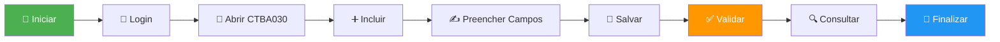

<div align="center">

# 🤖 Laboratório de Automação TIR
## Protheus Testing Framework

[](https://www.python.org/)
[](https://totvs.github.io/tir/)
[](https://www.selenium.dev/)
[](https://pytest.org/)
[](LICENSE)

### 🎯 *Um ambiente completo de estudos e experimentação com automação de testes para Totvs Protheus*

[📖 Documentação](#-sobre-o-projeto) • 
[🚀 Quick Start](#-quick-start--clone-e-configure) • 
[🧪 Casos de Teste](#-casos-de-teste-desenvolvidos) • 
[🎬 Demonstrações](#-demonstrações-visuais) • 
[🤝 Contribuir](#-como-contribuir)

</div>

---

## 📖 Sobre o Projeto

<table>
<tr>
<td width="60%">

Este repositório foi criado como um **laboratório de aprendizado prático** para quem deseja dominar automação de testes no ecossistema Totvs Protheus. 

### 🎓 O que você vai aprender?

- 🎯 **Automação de Testes** com TIR (Totvs Interface Robot)
- 🧠 **Lógica de Programação** aplicada a cenários reais
- 🔍 **Engenharia de Software** focada em Quality Assurance
- 📊 **Geração de Relatórios** e evidências de teste
- 🐛 **Debug e Troubleshooting** de aplicações web complexas

</td>
<td width="40%">

```python
# Exemplo de teste TIR
def test_protheus():
    oHelper = Webapp()
    oHelper.Setup(
        "SIGAGPE", 
        "01/01/2024"
    )
    oHelper.Program("GPEA010")
    oHelper.SetButton("Incluir")
    oHelper.SetValue(
        "RA_MAT", 
        "000001"
    )
    oHelper.AssertTrue()
```

</td>
</tr>
</table>

### 💡 Por que este projeto existe?

<div align="center">

| ✅ Casos de teste **reais e funcionais** | ✅ Exemplos **progressivos** |
|:---:|:---:|
| **✅ Documentação inline** completa | **✅ Estrutura profissional** |
| ✅ Geração automática de **logs e relatórios** | ✅ **Screenshots** de evidências |

</div>

---

## 🚀 Quick Start — Clone e Configure

### 📋 Pré-requisitos

<div align="center">

| Ferramenta | Versão | Status |
|:---:|:---:|:---:|
| 🐍 **Python** | 3.12+ | Obrigatório |
| 💻 **PowerShell** | 5.1+ | Windows |
| 🌐 **Protheus Webapp** | Qualquer | Acesso necessário |
| 📦 **Git** | Última | Recomendado |

</div>

### ⚡ Instalação Rápida

```powershell
# 1️⃣ Clone o repositório
git clone https://github.com/valdeircesario/Teste_Tir_Protheus.git
cd Teste_Tir_Protheus

# 2️⃣ Execute o setup automático
.\setup.ps1

# 3️⃣ Ative o ambiente virtual
.\venv\Scripts\Activate.ps1

# 4️⃣ Configure suas credenciais
Copy-Item config.template.json config.json
notepad config.json  # Edite com seus dados
```

<details>
<summary>📝 <strong>Clique para ver exemplo de config.json</strong></summary>

```json
{
  "url": "http://seu-servidor:8080/",
  "initial_program": "SIGAGPE",
  "user": "admin",
  "password": "sua_senha_aqui",
  "browser": "firefox",
  "DebugLog": true,
  "LogFolder": "Log",
  "ScreenshotFolder": "screenshot"
}
```

</details>

---

## 🎬 Demonstrações Visuais

### 🎥 Automação em Ação

<div align="center">

https://github.com/valdeircesario/Teste_Tir_Protheus/assets/screenshot/VIDEOS/2026-01-01%2018-43-09.mp4

*🎬 Vídeo demonstrativo: Execução completa de teste automatizado no Protheus*

</div>

> 💡 **Dica:** O vídeo mostra a automação completa desde o login até a validação final dos dados cadastrados.

---

## 🧪 Casos de Teste Desenvolvidos

### 📁 Estrutura Organizada por Módulos

```
📦 tests/
┣ 📂 Pessoal/
┃ ┣ 📄 test_GPEA010.py      # 👤 Cadastro de Funcionários
┃ ┣ 📄 test_CTBA030.py      # 💼 Centro de Custo
┃ ┣ 📄 test_PX*.py          # 💰 Folha de Pagamento
┃ ┗ 📄 ...
┣ 📂 Financeiro/            # 💵 Em desenvolvimento
┗ 📄 test_tir_example.py    # ✅ Validação básica
```

---

### 🎯 Casos de Teste Detalhados

<div align="center">

## 💼 Teste: Centro de Custo (CTBA030)

</div>

#### 📊 Objetivo do Teste

Automatizar o fluxo completo de **inclusão, validação e consulta** de centros de custo no sistema Protheus, garantindo integridade dos dados cadastrados.

#### 🎬 Demonstração em Imagens

<div align="center">

### 1️⃣ Tela Principal - Centro de Custo


*Interface principal da rotina CTBA030 - Cadastro de Centro de Custo*

---

### 2️⃣ Inclusão de Novo Registro


*Preenchimento automático dos campos através do TIR Framework*

---

### 3️⃣ Validação de Dados


*Verificação automática dos dados inseridos e validações de negócio*

---

### 4️⃣ Confirmação de Sucesso


*Confirmação de gravação e consulta do registro criado*

</div>

#### 📝 Fluxo do Teste



#### 💻 Código do Teste

```python
def test_incluir_centro_custo(self):
    """
    Teste: Inclusão de Centro de Custo
    
    Cenário:
        1. Acessa rotina CTBA030
        2. Clica em "Incluir"
        3. Preenche código e descrição
        4. Salva o registro
        5. Valida gravação
        6. Consulta registro criado
    """
    # Acessa a rotina
    self.oHelper.Program("CTBA030")
    self.oHelper.WaitShow("Centro de Custo")
    
    # Inicia inclusão
    self.oHelper.SetButton("Incluir")
    
    # Preenche campos obrigatórios
    self.oHelper.SetValue("CTT_CUSTO", "001001")
    self.oHelper.SetValue("CTT_DESC01", "CENTRO TESTE AUTOMATIZADO")
    self.oHelper.SetValue("CTT_CLASSE", "2")  # Analítico
    
    # Salva e valida
    self.oHelper.SetButton("Salvar")
    self.oHelper.AssertTrue()
    
    # Consulta registro
    self.oHelper.SetButton("Pesquisar")
    self.oHelper.SetValue("CTT_CUSTO", "001001")
    
    # Valida dados gravados
    desc = self.oHelper.GetValue("CTT_DESC01")
    assert desc == "CENTRO TESTE AUTOMATIZADO"
```

#### 🎓 Conceitos Aplicados

<table>
<tr>
<td width="50%">

**Técnicas de Automação:**
- ✅ Navegação por rotinas
- ✅ Manipulação de formulários
- ✅ Validação de campos
- ✅ Assertions customizadas
- ✅ Screenshots de evidência

</td>
<td width="50%">

**Boas Práticas:**
- ✅ Espera por elementos
- ✅ Tratamento de erros
- ✅ Logging detalhado
- ✅ Código limpo e documentado
- ✅ Reutilização de métodos

</td>
</tr>
</table>

---

<div align="center">

## 👤 Teste: Cadastro de Funcionário (GPEA010)

</div>

#### 📊 Objetivo do Teste

Validar o **fluxo completo de inclusão** de um novo funcionário no sistema, incluindo navegação entre múltiplas abas, preenchimento de dados pessoais, admissionais e validações de integridade.

#### 🎯 Cenário de Teste

```python
# Exemplo de código (snippet)
def test_incluir_funcionario(self):
    """
    Teste Complexo: Cadastro Completo de Funcionário
    
    Cobertura:
        - Dados Pessoais (aba 1)
        - Dados Admissionais (aba 2)
        - Endereço (aba 3)
        - Complementos (aba 4)
        - Validações de campos obrigatórios
    """
    self.oHelper.Program("GPEA010")
    self.oHelper.SetButton("Incluir")
    
    # 1️⃣ Aba: Dados Principais
    self.oHelper.SetValue("RA_MAT", "000001")
    self.oHelper.SetValue("RA_NOME", "TESTE AUTOMATIZADO TIR")
    self.oHelper.SetValue("RA_CPF", "12345678901")
    
    # 2️⃣ Navegação entre abas
    self.oHelper.SetTabEDAPaper("Dados Admissionais", 2)
    self.oHelper.SetValue("RA_ADMISSA", "01/01/2024")
    self.oHelper.SetValue("RA_CARGO", "DESENVOLVEDOR")
    
    # 3️⃣ Aba: Complementos
    self.oHelper.SetTabEDAPaper("Complementos", 3)
    self.oHelper.SetValue("RA_DEPTO", "001")
    self.oHelper.SetValue("RA_CC", "001001")
    
    # 4️⃣ Salvar e validar
    self.oHelper.SetButton("Salvar")
    self.oHelper.AssertTrue()
    
    # 5️⃣ Captura evidência
    self.oHelper.Screenshot("funcionario_cadastrado")
```

#### 💡 Conceitos Avançados

- 🔄 **Navegação entre abas** com `SetTabEDAPaper()`
- 🔍 **Validações em múltiplas camadas**
- 📸 **Evidências automáticas** com screenshots
- 🧩 **Formulários complexos** com dependências
- ⚠️ **Tratamento de campos obrigatórios**

---

<div align="center">

## ✅ Teste: Validação de Ambiente (test_tir_example.py)

</div>

#### 🎯 Propósito

Teste **"Hello World"** para garantir que o ambiente está configurado corretamente e o TIR está funcional.

```python
def test_ambiente_configurado():
    """
    Teste Básico: Validação de Ambiente
    
    Valida:
        ✅ Conexão com Protheus
        ✅ Carregamento do TIR Framework
        ✅ Abertura de rotina simples
        ✅ Captura de screenshot
    """
    oHelper = Webapp()
    oHelper.Setup("SIGAGPE", "01/01/2024", "01", "01")
    oHelper.Program("GPEA010")
    oHelper.Screenshot("teste_conexao_ok")
    oHelper.TearDown()
    
    print("✅ Ambiente configurado com sucesso!")
```

---

## 🛠️ Stack Tecnológico

<div align="center">

### Core Framework

| Tecnologia | Versão | Descrição |
|:---:|:---:|:---|
|  | `2.4.3` | Framework de automação Totvs |
|  | `3.12+` | Linguagem de programação |
|  | `Latest` | Automação de navegadores |

### Testing & Reporting

| Ferramenta | Função |
|:---:|:---|
|  | Framework de testes moderno |
|  | Geração de relatórios HTML |
|  | Execução paralela (opcional) |

### Browsers Suportados

🦊 **Firefox** (recomendado) • 🌐 **Chrome/Chromium** • 🌊 **Edge** (experimental)

</div>

---

## 📊 Logs, Debug e Relatórios

### 📝 Sistema de Logging Detalhado

<table>
<tr>
<td width="50%">

**Estrutura de Logs:**

```
📁 Log/
├── 📄 webapp_log_20240101_123045.log
├── 📄 selenium_grid.log
└── 📄 execution_summary.txt
```

</td>
<td width="50%">

**Configuração:**

```json
{
  "DebugLog": true,  // Logs verbosos
  "LogFolder": "Log",
  "ScreenshotFolder": "screenshot"
}
```

</td>
</tr>
</table>

### 📸 Screenshots Automáticos

<div align="center">

| Situação | Comportamento | Localização |
|:---:|:---|:---:|
| ✅ **Sucesso** | Screenshots opcionais | `screenshot/` |
| ❌ **Falha** | Captura automática no erro | `screenshot/` |
| 🎯 **Customizado** | Via `oHelper.Screenshot()` | `screenshot/` |

</div>

### 📈 Relatórios HTML Profissionais

```powershell
# Gerar relatório completo
pytest tests/ --html=report.html --self-contained-html
```

<details>
<summary>📊 <strong>O que contém o relatório?</strong></summary>

- ✅ Taxa de sucesso/falha por teste
- ⏱️ Tempo de execução detalhado
- 📸 Screenshots embarcados inline
- 📋 Logs de erro com stack trace
- 📈 Gráficos de performance
- 🏷️ Tags e categorias de testes

</details>

---

## 🎮 Comandos de Execução

### 🚀 Executar Teste Individual

```powershell
# Output detalhado no terminal
python -m pytest tests/Pessoal/test_GPEA010.py -v -s

# Com relatório HTML embutido
python -m pytest tests/Pessoal/test_GPEA010.py -v --html=report_GPEA010.html --self-contained-html
```

### 📦 Executar Suite Completa

```powershell
# Módulo específico
pytest tests/Pessoal/ -v --html=report_pessoal.html --self-contained-html

# Toda a suite
pytest tests/ -v --html=report_completo.html --self-contained-html
```

### 🔍 Executar com Filtros

```powershell
# Apenas testes que contêm "GPEA"
pytest tests/ -k "GPEA" -v

# Executar em paralelo (4 workers)
pytest tests/ -n 4 -v

# Por marcadores (tags)
pytest tests/ -m "funcionario" -v
```

### 🐛 Debug Mode

<table>
<tr>
<td width="50%">

```powershell
# Parar no primeiro erro
pytest tests/ -x -v

# Mostrar prints em tempo real
pytest tests/ -s -v
```

</td>
<td width="50%">

```powershell
# Modo super verboso
pytest tests/ -vv -s --tb=long

# Reexecutar apenas falhas
pytest tests/ --lf -v
```

</td>
</tr>
</table>

---

## 🎓 Aprenda Praticando

<div align="center">

### 🌱 Iniciante → 🌿 Intermediário → 🌳 Avançado

</div>

<table>
<tr>
<td width="33%">

### 🌱 Iniciante

1. ✅ `test_tir_example.py`  
   *Estrutura básica*

2. ✅ `test_CTBA030.py`  
   *Formulários simples*

3. ✅ Analise comentários inline

4. ✅ Execute com `-s` para debug

</td>
<td width="33%">

### 🌿 Intermediário

1. ✅ Customize `test_GPEA010.py`

2. ✅ Crie novos casos de teste

3. ✅ Experimente assertions

4. ✅ Implemente tratamento de erros

</td>
<td width="34%">

### 🌳 Avançado

1. ✅ Page Object Pattern

2. ✅ Fixtures customizadas

3. ✅ Integração CI/CD

4. ✅ Relatórios customizados

</td>
</tr>
</table>

---

## 🐛 Troubleshooting

<details>
<summary>❌ <strong>"WebDriver not found"</strong></summary>

```powershell
# Solução: Reinstalar selenium e driver
pip install --upgrade selenium

# Firefox: Baixe geckodriver em https://github.com/mozilla/geckodriver/releases
# Adicione ao PATH do sistema
```

</details>

<details>
<summary>❌ <strong>"Connection refused to Protheus"</strong></summary>

**Checklist de validação:**
- ✅ Protheus está rodando?
- ✅ URL e porta corretas no `config.json`?
- ✅ Consegue acessar manualmente no navegador?
- ✅ Firewall bloqueando a porta?

</details>

<details>
<summary>❌ <strong>"Element not found"</strong></summary>

```python
# Solução: Aumentar timeout
self.oHelper.SetTimeout(30)  # 30 segundos

# Aguardar elemento específico
self.oHelper.WaitShow("Nome do Campo")

# Capturar screenshot para análise
self.oHelper.Screenshot("debug_elemento_nao_encontrado")
```

</details>

<details>
<summary>❌ <strong>"Screenshot folder not found"</strong></summary>

```powershell
# Criar diretórios manualmente
mkdir Log, screenshot

# Ou via Python
python -c "import os; os.makedirs('Log', exist_ok=True); os.makedirs('screenshot', exist_ok=True)"
```

</details>

---

## 🤝 Como Contribuir

<div align="center">

### 💪 Contribuições são extremamente bem-vindas!

Este é um projeto **educacional** e **colaborativo**

</div>

### 🎯 Formas de Contribuir

<table>
<tr>
<td width="50%">

**📝 Documentação:**
- Melhorar README
- Adicionar comentários em código
- Criar tutoriais
- Traduzir documentação

</td>
<td width="50%">

**💻 Código:**
- Novos casos de teste
- Correção de bugs
- Otimização de performance
- Novos recursos TIR

</td>
</tr>
<tr>
<td width="50%">

**🎨 Visual:**
- Screenshots de testes
- Vídeos demonstrativos
- Diagramas de fluxo
- Melhorias de UI

</td>
<td width="50%">

**🐛 Quality Assurance:**
- Reportar bugs
- Sugerir melhorias
- Revisar Pull Requests
- Testar em ambientes diferentes

</td>
</tr>
</table>

### 🔄 Processo de Contribuição

```bash
# 1. Fork este repositório
# 2. Clone seu fork
git clone https://github.com/SEU_USUARIO/Teste_Tir_Protheus.git

# 3. Crie uma branch descritiva
git checkout -b feature/novo-teste-financeiro

# 4. Faça suas alterações e commit
git add .
git commit -m "✨ Adiciona teste para rotina FINA040"

# 5. Push para seu fork
git push origin feature/novo-teste-financeiro

# 6. Abra um Pull Request
```

### ✅ Diretrizes de Código

- 📐 Siga **PEP 8** (formatação Python)
- 📚 Adicione **docstrings** em funções
- 💬 Comente **lógicas complexas**
- ✅ Inclua **assertions claras**
- 🧪 **Teste localmente** antes do PR
- 📸 Adicione **screenshots** quando relevante

---

## 📚 Recursos Adicionais

<div align="center">

### 📖 Documentação Oficial

| Recurso | Link |
|:---:|:---|
| 🤖 **TIR Framework** | [GitHub](https://github.com/totvs/tir) • [Docs](https://totvs.github.io/tir/) |
| 🧪 **Pytest** | [Documentação Oficial](https://docs.pytest.org/) |
| 🌐 **Selenium** | [Python Docs](https://selenium-python.readthedocs.io/) |
| 📘 **Totvs TDN** | [Portal TDN](https://tdn.totvs.com/display/framework/TIR) |

### 🎓 Tutoriais Recomendados

- 📝 [Introdução ao TIR (Totvs)](https://tdn.totvs.com/display/framework/TIR)
- 🐍 [Automação com Python e Selenium](https://realpython.com/modern-web-automation-with-python-and-selenium/)
- 🎯 [Boas Práticas em Test Automation](https://testautomationu.applitools.com/)
- 🧪 [Pytest: Guia Completo](https://pytest-with-eric.com/)

</div>

---

## 📜 Licença

<div align="center">

Este projeto está licenciado sob a **MIT License**

[](LICENSE)

**Você pode:** Usar • Copiar • Modificar • Distribuir • Uso comercial

**Condição:** Manter o aviso de copyright original

</div>

---

## 🌟 Agradecimentos

<div align="center">

### 💙 Um agradecimento especial para:

**[Totvs](https://www.totvs.com/)** pelo desenvolvimento do TIR Framework  
**[Comunidade Python Brasil](https://python.org.br/)** pelo suporte contínuo  
**Todos os [contribuidores](https://github.com/valdeircesario/Teste_Tir_Protheus/graphs/contributors)** deste repositório

</div>

---

## 📬 Contato e Suporte

<div align="center">

[](https://linkedin.com/in/valdeircesario)
[](https://github.com/valdeircesario)
[](https://github.com/valdeircesario/Teste_Tir_Protheus/issues)

### 💬 Tem dúvidas? Precisa de ajuda?

Use a aba **[Issues](https://github.com/valdeircesario/Teste_Tir_Protheus/issues)** para reportar problemas ou fazer perguntas

</div>

---

<div align="center">

## ⭐ Se este projeto foi útil para você, considere dar uma estrela! ⭐

### 📈 Status do Projeto


---

**Made with ❤️ and ☕ by [Valdeir Cesário](https://github.com/valdeircesario)**

*Transformando código em conhecimento, um teste por vez* 🚀

</div>