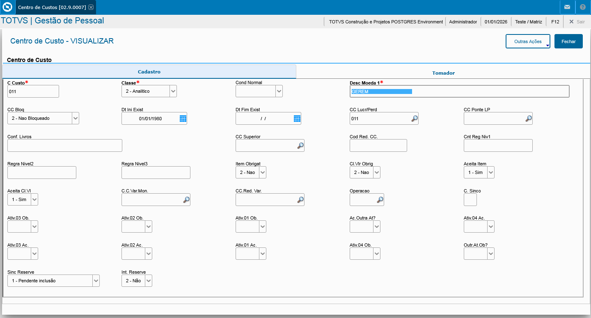
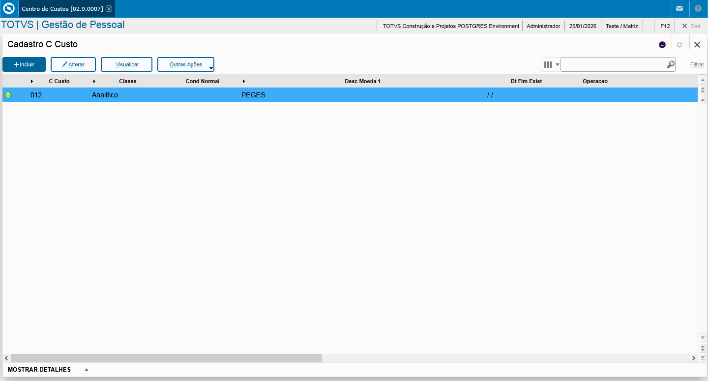
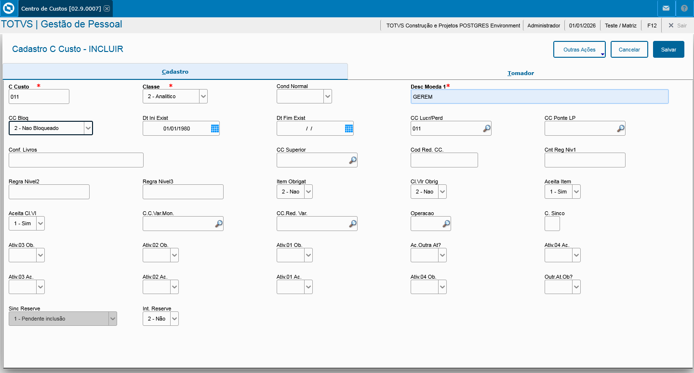

# 🤖 Laboratório de Automação TIR — Protheus Testing Framework

[](https://www.python.org/)
[](https://totvs.github.io/tir/)
[](https://www.selenium.dev/)
[](https://pytest.org/)
[](LICENSE)

> **Um ambiente completo de estudos e experimentação com automação de testes para Totvs Protheus usando TIR Framework**

---

## 📖 Sobre o Projeto

Este repositório foi criado como um **laboratório de aprendizado prático** para quem deseja dominar automação de testes no ecossistema Totvs Protheus. Aqui você encontrará casos de teste reais, exemplos comentados e uma estrutura profissional para desenvolver suas habilidades em:

- 🎯 **Automação de Testes** com TIR (Totvs Interface Robot)
- 🧠 **Lógica de Programação** aplicada a cenários reais
- 🔍 **Engenharia de Software** focada em Quality Assurance
- 📊 **Geração de Relatórios** e evidências de teste
- 🐛 **Debug e Troubleshooting** de aplicações web complexas

### 🎓 Por que este projeto existe?

O **TIR Framework** é uma poderosa ferramenta desenvolvida pela Totvs para automação de testes em suas aplicações, mas dominar seus recursos requer prática. Este repositório oferece:

- ✅ Casos de teste **reais e funcionais** prontos para execução
- ✅ Exemplos **progressivos** do básico ao avançado
- ✅ **Documentação inline** explicando cada decisão técnica
- ✅ Estrutura de projeto **profissional** com boas práticas
- ✅ Geração automática de **logs, screenshots e relatórios HTML**

---

## 🚀 Quick Start — Clone e Configure

### Pré-requisitos

- **Python 3.12+** instalado
- **PowerShell** (para scripts de setup no Windows)
- Acesso a uma instância **Totvs Protheus Webapp**
- **Git** para clonar o repositório

### Passo a Passo

```powershell
# 1. Clone o repositório
git clone https://github.com/valdeircesario/Teste_Tir_Protheus.git
cd Teste_Tir_Protheus

# 2. Execute o script de configuração automática (Windows)
.\setup.ps1

# 3. Ative o ambiente virtual
.\venv\Scripts\Activate.ps1

# 4. Configure suas credenciais
Copy-Item config.template.json config.json
# Edite config.json com os dados do seu ambiente Protheus
```

### Estrutura do `config.json`

```json
{
  "url": "http://seu-servidor:porta/",
  "initial_program": "SIGAGPE",
  "user": "seu_usuario",
  "password": "sua_senha",
  "browser": "firefox",
  "DebugLog": true,
  "LogFolder": "Log",
  "ScreenshotFolder": "screenshot"
}
```

---

## 🧪 Casos de Teste Desenvolvidos

### 📁 Estrutura Organizada por Módulos

```
tests/
├── Pessoal/              # Módulo de Gestão de Pessoal
│   ├── test_GPEA010.py   # Cadastro de Funcionários
│   ├── test_CTBA030.py   # Centro de Custo
│   ├── test_PX*.py       # Folha de Pagamento e Benefícios
│   └── ...
├── Financeiro/           # Testes do módulo financeiro (em breve)
└── test_tir_example.py   # Teste básico de validação
```

---

### 🎯 Casos de Teste Principais

#### 1️⃣ `test_GPEA010.py` — Cadastro de Funcionário (Complexo)

**Objetivo:** Validar o fluxo completo de inclusão de um novo funcionário no sistema.

**Cenário de Teste:**
- Navegação para rotina GPEA010
- Preenchimento de múltiplas abas (Dados Pessoais, Admissão, Endereço, etc.)
- Validação de campos obrigatórios
- Confirmação de gravação
- Verificação de dados cadastrados

**Conceitos Aplicados:**
- Manipulação de formulários complexos
- Navegação entre abas (SetTabEDAPaper)
- Tratamento de campos obrigatórios
- Assertions e validações customizadas

```python
# Exemplo de código (snippet)
def test_incluir_funcionario(self):
    self.oHelper.Program("GPEA010")
    self.oHelper.SetButton("Incluir")
    
    # Aba 1: Dados Principais
    self.oHelper.SetValue("RA_MAT", "000001")
    self.oHelper.SetValue("RA_NOME", "TESTE AUTOMATIZADO")
    
    # Navegação entre abas
    self.oHelper.SetTabEDAPaper("Complementos", 2)
    self.oHelper.SetValue("RA_DEPTO", "001")
    
    self.oHelper.SetButton("Salvar")
    self.oHelper.AssertTrue()
```

**🖼️ Demonstração Visual:**

<!-- Adicione aqui screenshots do teste em execução -->


---

#### 2️⃣ `test_CTBA030.py` — Centro de Custo

**Objetivo:** Automatizar a inclusão e validação de centros de custo.

**Fluxo de Teste:**
1. Acesso à rotina CTBA030
2. Inclusão de novo centro de custo
3. Preenchimento de código e descrição
4. Validação de persistência dos dados
5. Consulta do registro criado

**Técnicas Demonstradas:**
- Uso de `SetValue()` para campos alfanuméricos
- Validação com `GetValue()` e comparação
- Ciclo completo: Incluir → Salvar → Consultar

**🖼️ Demonstração Visual:**






---
### Videos de demostração




#### 3️⃣ `test_PX*.py` — Rotinas de Folha de Pagamento

**Família de Testes:** Diversos scripts cobrindo:
- Cálculo de folha
- Benefícios e descontos
- Integrações com módulos externos
- Relatórios gerenciais

**Habilidades Desenvolvidas:**
- Testes de integração entre módulos
- Validação de cálculos complexos
- Manipulação de grids e tabelas
- Exportação e validação de relatórios

---

#### 4️⃣ `test_tir_example.py` — Validação de Ambiente

**Propósito:** Teste "hello world" para garantir que a configuração está correta.

**O que valida:**
- Conexão com Protheus
- Carregamento do framework TIR
- Abertura de rotina básica
- Captura de screenshot

```python
def test_ambiente_configurado():
    """Valida que o TIR está funcionando corretamente"""
    oHelper = Webapp()
    oHelper.Setup("SIGAGPE", "01/01/2024", "01", "01")
    oHelper.Program("GPEA010")
    oHelper.Screenshot("teste_conexao")
    oHelper.TearDown()
```

---

## 🛠️ Stack Tecnológico

### Core Framework
- **TIR Framework 2.4.3** — Biblioteca de automação Totvs
- **Python 3.12+** — Linguagem de programação
- **Selenium WebDriver** — Automação de navegadores

### Testing & Reporting
- **Pytest** — Framework de testes moderno
- **pytest-html** — Geração de relatórios HTML
- **pytest-xdist** — Execução paralela (opcional)

### Browsers Suportados
- 🦊 **Firefox** (recomendado)
- 🌐 **Chrome** / Chromium
- 🌊 **Edge** (experimental)

### Ferramentas de Desenvolvimento
- **VS Code** com extensões Python
- **Git** para controle de versão
- **PowerShell** para automação de setup

---

## 📊 Logs, Debug e Relatórios

### Sistema de Logging Detalhado

Todos os testes geram logs estruturados em `Log/`:

```
Log/
├── webapp_log_YYYYMMDD_HHMMSS.log
├── selenium_grid.log
└── execution_summary.txt
```

**Níveis de log configuráveis:**
- `DebugLog: true` — Logs verbosos com cada ação
- `DebugLog: false` — Apenas erros e warnings

### Screenshots Automáticos

Capturas de tela são salvas em `screenshot/`:
- ✅ **Em caso de sucesso:** screenshots opcionais
- ❌ **Em caso de falha:** screenshots automáticos no momento do erro

### Relatórios HTML Profissionais

Execute com geração de relatório:

```powershell
pytest tests/ --html=report.html --self-contained-html
```

**O relatório inclui:**
- ✅ Taxa de sucesso/falha
- ⏱️ Tempo de execução por teste
- 📸 Screenshots embarcados
- 📋 Logs de erro detalhados
- 📈 Gráficos de performance

**🖼️ Exemplo de Relatório:**


---

## 🎮 Comandos de Execução

### Executar Teste Individual

```powershell
# Com output detalhado
python -m pytest tests/Pessoal/test_GPEA010.py -v -s

# Com relatório HTML
python -m pytest tests/Pessoal/test_GPEA010.py -v --html=report_GPEA010.html --self-contained-html
```

### Executar Suite Completa

```powershell
# Todos os testes do diretório Pessoal
pytest tests/Pessoal/ -v --html=report_pessoal.html --self-contained-html

# Toda a suite de testes
pytest tests/ -v --html=report_completo.html --self-contained-html
```

### Executar com Filtros

```powershell
# Apenas testes que contêm "GPEA" no nome
pytest tests/ -k "GPEA" -v

# Executar testes em paralelo (requer pytest-xdist)
pytest tests/ -n 4 -v
```

### Debug Mode

```powershell
# Parar no primeiro erro
pytest tests/ -x -v

# Mostrar prints em tempo real
pytest tests/ -s -v

# Modo super verboso
pytest tests/ -vv -s --tb=long
```

---

## 🎓 Aprenda Praticando

### Para Iniciantes

1. Comece com `test_tir_example.py` para entender a estrutura básica
2. Estude `test_CTBA030.py` para aprender manipulação de formulários simples
3. Analise os comentários inline em cada teste
4. Execute os testes passo a passo com `-s` para ver o que acontece

### Para Intermediários

1. Customize `test_GPEA010.py` para seu ambiente
2. Crie novos casos de teste baseados nos exemplos
3. Experimente com diferentes assertions e validações
4. Implemente tratamento de erros customizado

### Para Avançados

1. Implemente Page Object Pattern
2. Crie fixtures customizadas no pytest
3. Integre com CI/CD (Jenkins, GitLab CI, GitHub Actions)
4. Desenvolva relatórios customizados

---

## 🐛 Troubleshooting

### Problemas Comuns

**1. "WebDriver not found"**
```powershell
# Reinstale o selenium e geckodriver
pip install --upgrade selenium
# Firefox: geckodriver deve estar no PATH
```

**2. "Connection refused to Protheus"**
- Verifique se o Protheus está rodando
- Confirme URL e porta no `config.json`
- Teste acesso manual no navegador

**3. "Element not found"**
- Aumente timeouts no TIR
- Verifique se a rotina foi carregada completamente
- Use `oHelper.WaitShow()` antes de interagir

**4. "Screenshot folder not found"**
```powershell
# Crie os diretórios manualmente
mkdir Log, screenshot
```

---

## 🤝 Como Contribuir

Contribuições são extremamente bem-vindas! Este é um projeto educacional e colaborativo.

### Formas de Contribuir

- 🐛 **Reportar bugs** ou comportamentos inesperados
- 📝 **Melhorar documentação** e comentários
- ✨ **Adicionar novos casos de teste**
- 🎨 **Incluir screenshots** e evidências visuais
- 🔧 **Otimizar código** existente

### Processo de Contribuição

1. **Fork** este repositório
2. Crie uma **branch** descritiva:
   ```bash
   git checkout -b feature/novo-teste-financeiro
   ```
3. Faça commits **pequenos e claros**:
   ```bash
   git commit -m "Adiciona teste para rotina FINA040"
   ```
4. **Push** para seu fork:
   ```bash
   git push origin feature/novo-teste-financeiro
   ```
5. Abra um **Pull Request** com:
   - Descrição do que foi feito
   - Screenshots (se aplicável)
   - Logs de execução bem-sucedida

### Diretrizes de Código

- ✅ Siga PEP 8 (formatação Python)
- ✅ Adicione docstrings em funções
- ✅ Comente lógicas complexas
- ✅ Inclua assertions claras
- ✅ Teste localmente antes do PR

---

## 📚 Recursos Adicionais

### Documentação Oficial

- [TIR Framework — GitHub](https://github.com/totvs/tir)
- [TIR Framework — Documentação](https://totvs.github.io/tir/)
- [Pytest — Docs Oficiais](https://docs.pytest.org/)
- [Selenium Python — Docs](https://selenium-python.readthedocs.io/)

### Tutoriais e Artigos

- [Introdução ao TIR (Totvs)](https://tdn.totvs.com/display/framework/TIR)
- [Automação de Testes com Selenium](https://realpython.com/modern-web-automation-with-python-and-selenium/)
- [Boas Práticas em Test Automation](https://testautomationu.applitools.com/)

---

## 📜 Licença

Este projeto está licenciado sob a **MIT License** — veja o arquivo [LICENSE](LICENSE) para detalhes.

**Em resumo:** Você pode usar, copiar, modificar e distribuir este código livremente, desde que mantenha o aviso de copyright original.

---

## 🌟 Agradecimentos

- **Totvs** pelo desenvolvimento do TIR Framework
- Comunidade **Python Brasil** pelo suporte
- Todos os **contribuidores** deste repositório

---

## 📬 Contato e Suporte

- 💼 **LinkedIn:** [Valdeir Cesário](https://linkedin.com/in/valdeircesario)
- 🐙 **GitHub:** [@valdeircesario](https://github.com/valdeircesario)
- 📧 **Issues:** Use a aba [Issues](https://github.com/valdeircesario/Teste_Tir_Protheus/issues) para reportar problemas

---

<div align="center">

**⭐ Se este projeto foi útil para você, considere dar uma estrela no GitHub! ⭐**

Made with ❤️ and ☕ by [Valdeir Cesário](https://github.com/valdeircesario)

</div>