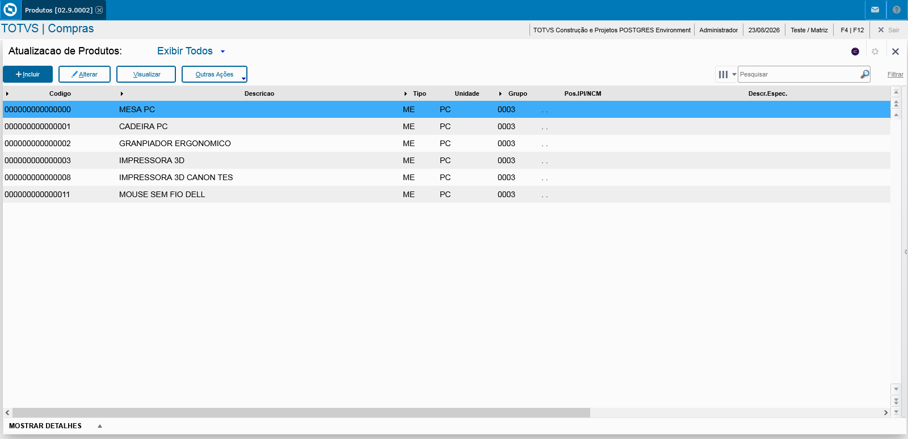
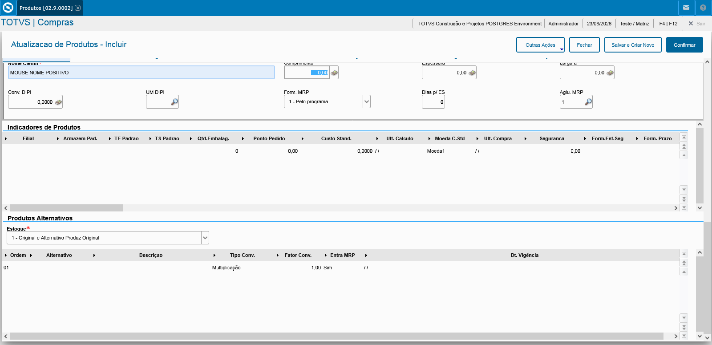
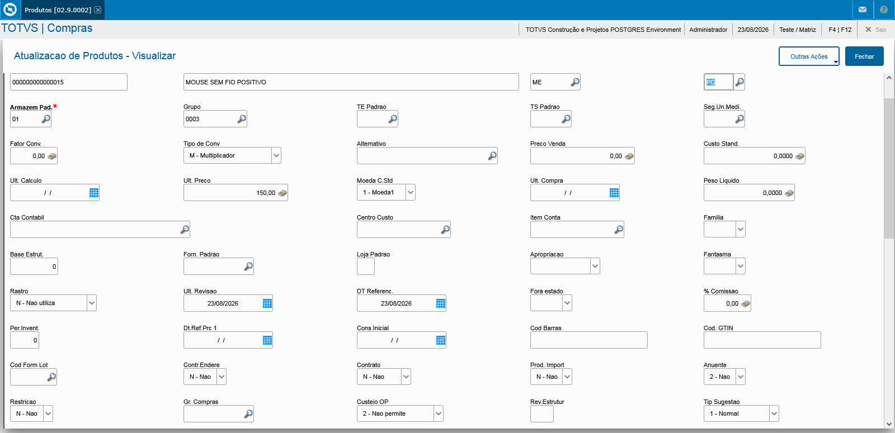
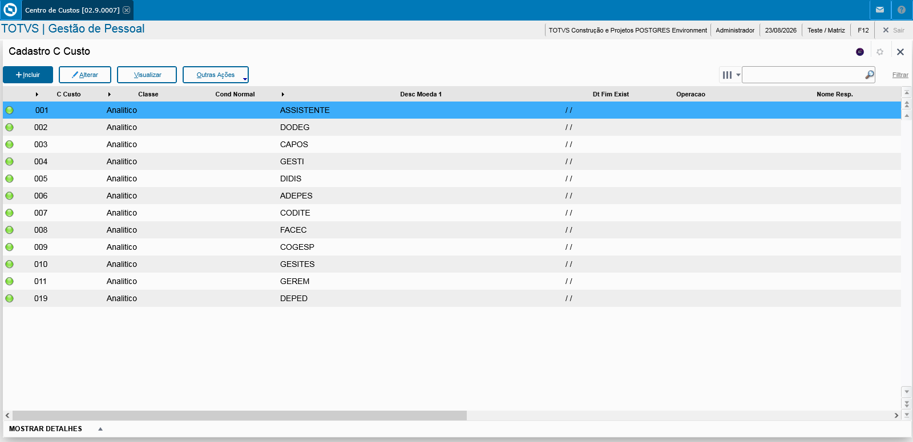
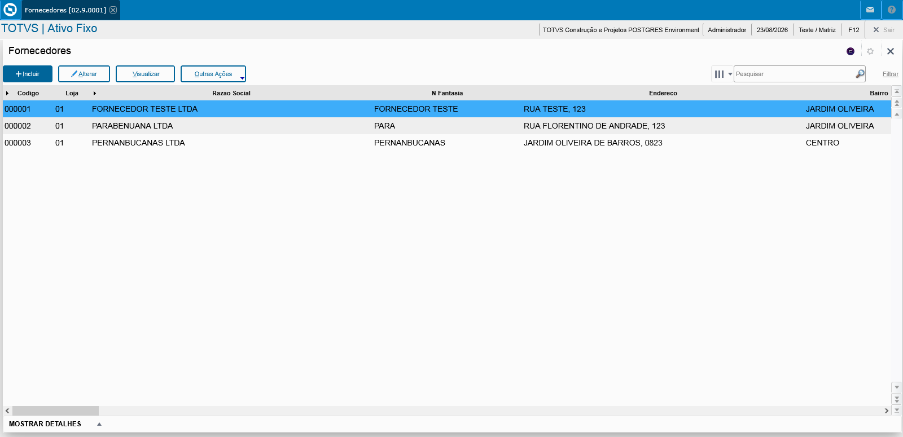
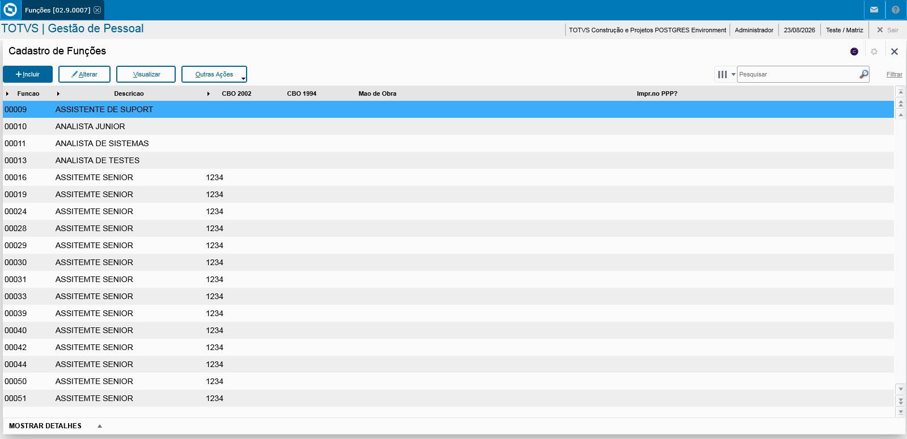
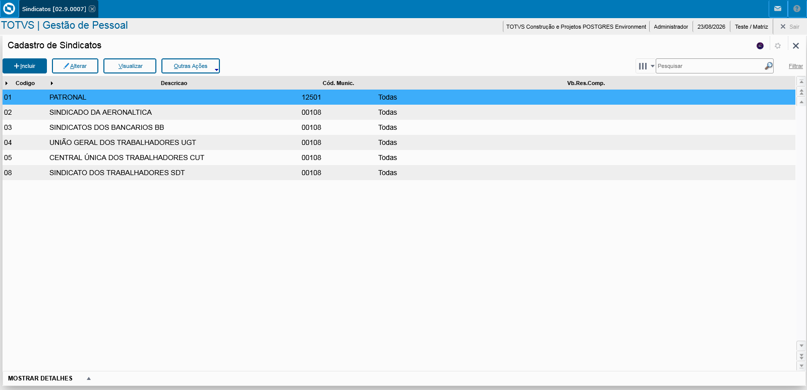
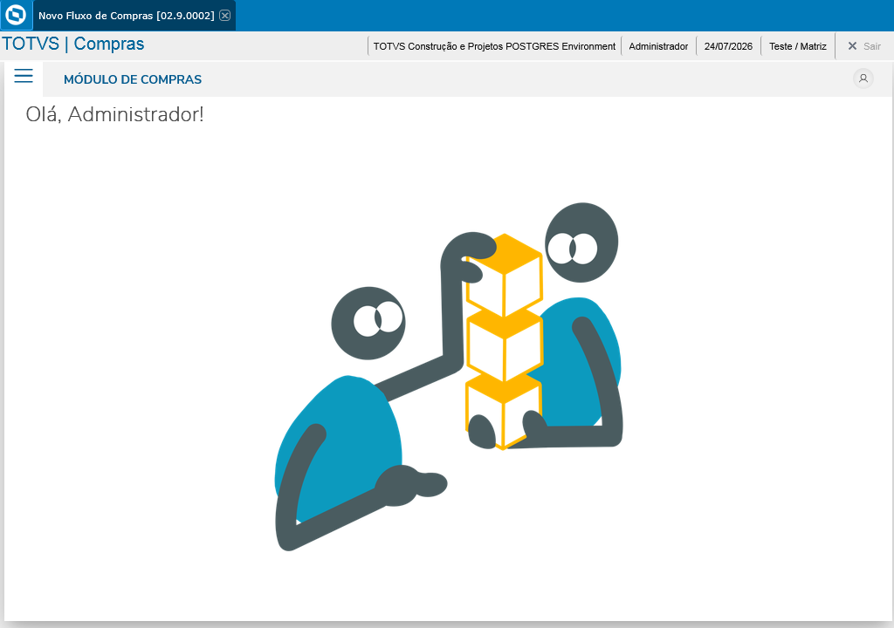
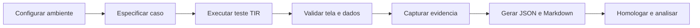

<div align="center">

# TIR Protheus Testing Lab

### Automacao funcional para rotinas tradicionais e telas PO-UI do TOTVS Protheus

[](https://www.python.org/)
[](https://totvs.github.io/tir/)
[](https://www.selenium.dev/)
[](https://docs.pytest.org/)

**Um laboratorio pratico de QA que transforma fluxos do ERP em cenarios automatizados, rastreaveis e visiveis.**

[Comecar](#-comece-em-poucos-minutos) · [O que existe aqui](#-o-que-o-projeto-entrega) · [Evidencias](#-evidencias-reais) · [Documentacao](#-documentacao)

</div>

---

## Sobre o projeto

Este repositorio reune uma suite de automacao para o TOTVS Protheus, construida com Python, TIR Framework e Selenium. O foco e validar processos de negocio reais, desde cadastros tradicionais do MDI ate fluxos modernos construidos com PO-UI e Angular.

Mais do que clicar em telas, o projeto organiza o ciclo completo de qualidade:

- especificacao funcional em Markdown;
- execucao automatizada com `unittest` e `pytest`;
- validacao de campos, mensagens e dados persistidos;
- screenshots e logs como evidencia de execucao;
- relatorios consolidados em JSON e Markdown;
- guia visual de homologacao gerado a partir do codigo de teste.

> O projeto foi desenvolvido como laboratorio de aprendizado e experimentacao aplicada em QA, automacao web e ecossistema TOTVS.

## O que o projeto entrega

| Capacidade | Aplicacao |
| --- | --- |
| Automacao funcional | Inclusao, consulta, alteracao, exclusao e fluxos de negocio |
| Cobertura de modulos | Compras, Gestao de Pessoal, Ativo Fixo, CSA e Contabilidade |
| Interface tradicional | `Webapp` e comandos nativos do TIR |
| Interface PO-UI | Menus, filtros, tabelas, abas, combos, switches e icones |
| Evidencia auditavel | Screenshots nomeados, logs nativos e relatórios |
| Diagnostico | Selenium direto, esperas explicitas e suporte a Shadow DOM |

## Evidencias reais

As imagens abaixo sao capturas existentes no repositorio e mostram o tipo de evidencia produzido pelos testes.

### Cadastro de produto · MATA010

<div align="center">





</div>

### Cadastros e rotinas de negocio

<div align="center">






</div>

### Evidencia de fluxo PO-UI

<div align="center">



</div>

> As capturas sao organizadas em `screenshot/<rotina>/`. A pasta `Log/` preserva artefatos nativos do TIR, enquanto `screenshot/VIDEOS/` armazena demonstracoes gravadas.

## Modulos cobertos

| Modulo | Pasta | Exemplos de rotinas |
| --- | --- | --- |
| Gestao de Pessoal | `tests/SIGAGPE` | GPEA010, GPEA011, GPEA020, GPEA030, GPEA340, GPEA370 |
| Compras | `tests/SIGACOM` | AGRA045, MATA010, MATA020, MATA110, MATA360 |
| Ativo Fixo | `tests/SIGAATF` | MATA020 |
| CSA | `tests/SIGACSA` | CSAM010, TRMA030 |
| Contabilidade | `tests/SIGACTB` | CTBA010 |
| Experimentais e legados | `tests/Outros` | cenarios em evolucao e validacoes auxiliares |

O repositorio possui atualmente **75 arquivos Python de teste**, **14 casos funcionais documentados** e **117 screenshots** na arvore de evidencias.

## Arquitetura do repositorio

```text
Teste_Tir_Protheus/
├── tests/                 testes executaveis por modulo
│   ├── SIGAGPE/
│   ├── SIGACOM/
│   ├── SIGAATF/
│   ├── SIGACSA/
│   ├── SIGACTB/
│   └── Outros/
├── casos_de_testes/       especificacoes funcionais em Markdown
├── utilis/                helpers reutilizaveis e agente de relatorios
├── tools/                 extensoes Selenium e gerador HTML
├── screenshot/            evidencias visuais por rotina
├── Log/                   logs e artefatos nativos do TIR
├── docs/Project/          documentacao tecnica do projeto
├── docs/reports/          resultados consolidados por modulo
├── reports/               relatorios HTML do pytest
├── config.template.json   modelo de configuracao
├── setup.ps1              criacao do ambiente virtual
└── run_test.py            atalho legado de execucao
```

### Fluxo em uma imagem


```mermaid
flowchart LR
    A[Configurar ambiente] --> B[Especificar caso]
    B --> C[Executar teste TIR]
    C --> D[Validar tela e dados]
    D --> E[Capturar evidencia]
    E --> F[Gerar JSON e Markdown]
    F --> G[Homologar e analisar]
```

## Exemplo de automacao

O padrao dos testes combina preparacao de ambiente, navegacao, preenchimento, validacao e evidencia:

```python
class MATA010(unittest.TestCase):
    @classmethod
    def setUpClass(cls):
        webapp = Webapp("config.json")
        cls.oHelper = TirReportAgent(
            tir_instance=webapp,
            cod_modulo="02",
            nome_modulo="Compras",
            ct_nome="test_MATA010",
            descricao="Inclusao, Visualizacao e Alteracao de Produto",
        )
        cls.oHelper.Setup("SIGAMDI", DateSystem, "99", "01", "02")
        cls.oHelper.SetLateralMenu("Atualizacoes > Cadastros > Produtos")

    def test_de_incluir_produtos(self):
        self.oHelper.SetButton("Incluir")
        self.oHelper.WaitShow("Atualizacao de Produtos - Incluir")
        self.oHelper.SetValue("B1_COD", self.Codigo, check_value=False)
        self.oHelper.SetValue("B1_DESC", self.Descricao, check_value=False)
        self.oHelper.SetButton("Confirmar")
        self.oHelper.WaitShow("Registro inserido com sucesso.")
        self.oHelper.CheckResult("B1_DESC", self.Descricao)
        self.oHelper.Screenshot("Produto/004")
        self.oHelper.AssertTrue()
```

Os testes completos estao em [tests](tests), e os cenarios funcionais correspondentes em [casos_de_testes](casos_de_testes).

## Agente de relatorios

O `TirReportAgent`, em [utilis/md_reporter.py](utilis/md_reporter.py), funciona como um proxy sobre o `Webapp` e registra:

- cliques e confirmacoes;
- telas e mensagens aguardadas;
- insercoes e alteracoes;
- leituras de campos;
- screenshots;
- tempo de execucao;
- status e traceback de falhas;
- caminho funcional da rotina.

Cada execucao atualiza uma entrada em `resultados.json`, regenera o relatório Markdown do modulo e atualiza o painel em `docs/reports/index.md`.

[Ver a documentacao do agente](docs/Project/06-agente-relatorios.md) · [Abrir o painel de relatorios](docs/reports/index.md)

## Comece em poucos minutos

### Requisitos

- Windows com PowerShell 5.1 ou superior;
- Python 3.12 ou superior;
- acesso a um ambiente Protheus Webapp;
- Git;
- navegador compativel com a configuracao do TIR.

### Instalacao

```powershell
git clone https://github.com/valdeircesario/Teste_Tir_Protheus.git
cd Teste_Tir_Protheus
.\setup.ps1
.\venv\Scripts\Activate.ps1
Copy-Item config.template.json config.json
```

Edite `config.json` com a URL, usuario, senha, navegador e parametros do seu ambiente. O arquivo contem dados sensiveis e deve permanecer local.

### Executar um teste

```powershell
python -m pytest tests/SIGACOM/test_MATA010.py -v -s
```

### Executar um modulo

```powershell
python -m pytest tests/SIGAGPE -v -s
```

### Gerar relatorio HTML

```powershell
python -m pytest tests/SIGACOM/test_AGRA045.py -v --html=reports/agra045.html --self-contained-html
```

### Diagnosticar uma falha

```powershell
python -m pytest tests/SIGACOM/test_MATA010.py -x -v -s --tb=long
```

Depois da execucao, consulte `docs/reports/`, `reports/`, `screenshot/` e `Log/`.

## PO-UI e Selenium avancado

O fluxo [test_fluxo_necessidade_compra_poui.py](tests/test_fluxo_necessidade_compra_poui.py) combina:

- `Webapp` para login e navegacao inicial;
- `Poui` para componentes Angular;
- filtros e busca avancada;
- tabelas com checkbox;
- abas, selects, switches e icones;
- Selenium direto para componentes dinamicos e Shadow DOM.

O helper [poui_utilis.py](utilis/poui_utilis.py) demonstra como aguardar e acionar a busca avancada da tela PO-UI quando o comando de alto nivel nao e suficiente.

## Guia de homologacao visual

O arquivo [tools/gerador_relatorio.py](tools/gerador_relatorio.py) interpreta o codigo-fonte de um teste e monta um guia HTML com:

- pre-requisitos;
- caminho de menu;
- campos e valores;
- botoes e validacoes;
- screenshots incorporados em Base64 quando encontrados.

Esse gerador e complementar ao `TirReportAgent`: o agente registra a execucao real; o gerador cria uma leitura visual do roteiro para homologacao manual.

## Documentacao

A documentacao detalhada esta em [docs/Project](docs/Project/README.md):

- arquitetura e responsabilidades;
- configuracao e execucao;
- padrao dos testes;
- utilitarios e extensoes;
- agente de relatorios;
- casos funcionais;
- screenshots e logs;
- automacao PO-UI;
- fluxo operacional completo.

Os casos de negocio estao em [casos_de_testes](casos_de_testes), com exemplos de `CREATE`, `READ`, `UPDATE`, obrigatoriedade e duplicidade.

## Proximos passos naturais

- ampliar a correspondencia entre testes Python e casos Markdown;
- padronizar nomes de testes, classes e screenshots;
- vincular automaticamente as evidencias aos relatorios Markdown;
- centralizar fixtures e massa de dados reutilizavel;
- adicionar pipeline CI/CD para validacoes que nao dependam de sessao interativa;
- evoluir a cobertura de rotinas PO-UI.

## Contribuindo

1. Crie ou atualize o caso funcional em `casos_de_testes/`.
2. Implemente o fluxo em `tests/` seguindo o padrao existente.
3. Inclua validacoes e screenshots nas etapas relevantes.
4. Execute o teste contra um ambiente autorizado.
5. Registre o resultado e mantenha a documentacao alinhada.

## Links uteis

- [TIR Framework](https://totvs.github.io/tir/)
- [Repositorio do TIR](https://github.com/totvs/tir)
- [Selenium](https://www.selenium.dev/)
- [Pytest](https://docs.pytest.org/)
- [PO-UI](https://po-ui.io/documentation)
- [TOTVS TDN](https://tdn.totvs.com/display/framework/TIR)

<div align="center">

### Desenvolvido para aprender, automatizar e tornar a qualidade visivel.

[](https://github.com/valdeircesario)
[](https://github.com/valdeircesario/Teste_Tir_Protheus/issues)

</div>
