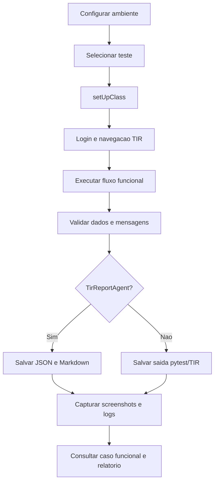

# Fluxo operacional do projeto

## Responsabilidade por camada

| Camada | Responsabilidade |
| --- | --- |
| `tests` | Implementar o comportamento automatizado |
| `casos_de_testes` | Definir o comportamento esperado |
| `utilis` | Reutilizar operacoes de apoio |
| `tools` | Resolver interacoes especiais e gerar guia HTML |
| `screenshot` | Armazenar evidencias visuais nomeadas pelo teste |
| `Log` | Armazenar diagnosticos nativos do TIR |
| `docs/reports` | Consolidar resultados estruturados e Markdown |
| `reports`/`report` | Publicar saidas HTML |

## Cenario de sucesso

O fluxo conclui as validacoes, `AssertTrue` passa, o agente salva status `PASSOU`, o teste libera o navegador e as evidencias ficam disponiveis para consulta.

## Cenario de falha

Uma excecao interrompe o fluxo, o agente registra traceback e status `FALHOU`, o erro e relancado para o executor e o bloco `finally` ainda salva o resultado. O `TearDown` deve ocorrer ao final da classe.

## Geracao de guia de homologacao

O processo legado de `tools/gerador_relatorio.py` e independente do agente Markdown. Ele le o fonte Python, interpreta chamadas conhecidas e gera um HTML visual para homologacao manual, podendo embutir imagens em Base64.
